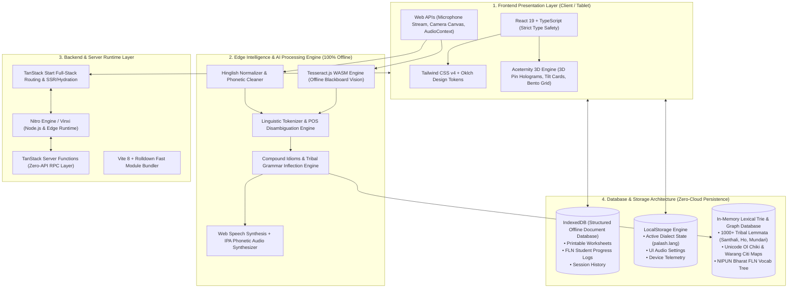
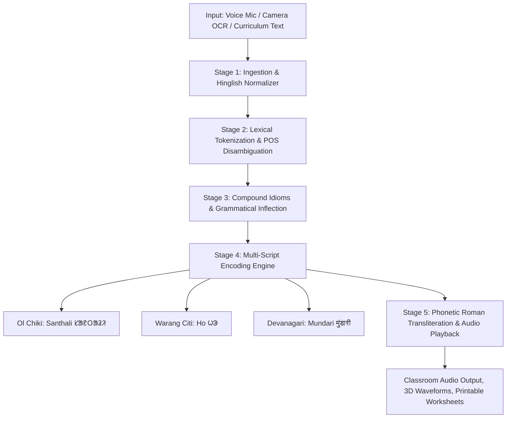

# 🌐 Bhasha Setu (भाषा सेतु)
### *Bridging Hindi Classrooms to Tribal Mother Tongues in Jharkhand*
**100% Offline-First Mother-Tongue-Based Multilingual Education (MTB-MLE) Edge AI Suite**

[](https://tanstack.com/start)
[](https://react.dev/)
[](https://tailwindcss.com/)
[](https://github.com)
[](https://lovable.dev)

---

## 📌 1. Executive Summary & Problem Statement

In rural and tribal belt schools across Jharkhand (such as Santhal Pargana, West Singhbhum, Khunti, and Gumla), primary education faces a severe linguistic barrier:
- **Teachers** instruct strictly in state-mandated **Hindi**.
- **Grade 1 to 3 primary tribal students** communicate exclusively in their home indigenous languages — **Santhali (ᱥᱟᱱᱛᱟᱲᱤ)**, **Ho (ᱦᱳ)**, or **Mundari (मुंडारी)**.
- **The Consequence:** Young learners cannot comprehend blackboard notes, textbook instructions, or oral lessons, causing alarming dropouts at the foundational stage (adversely impacting the national FLN — Foundational Literacy & Numeracy / NIPUN Bharat mission).
- **The Infrastructure Reality:** Rural forest schools operate with zero internet connectivity and unreliable electricity. Cloud-reliant AI solutions (such as Google Translate API or OpenAI) fail completely in these off-grid classrooms.

**Bhasha Setu (भाषा सेतु)** solves this problem with a **100% offline, client-side Edge AI suite** that instantaneously translates teacher speech, blackboard camera snapshots, and curriculum worksheets into indigenous scripts (**Ol Chiki**, **Warang Citi**, **Devanagari**) and spoken tribal dialects with sub-millisecond latency on low-cost school tablets.

---

## 🏗️ 2. Technology Stack & End-to-End System Architecture

Bhasha Setu is designed with a **Decoupled Edge-First Full-Stack Architecture**. Because tribal primary schools in Jharkhand are located in off-grid rural forest areas with zero internet connectivity, the application separates the build-time and server-side capabilities from an autonomous, client-side embedded AI and database engine.

---

### 🏛️ Complete System Architecture Diagram



---

### 💻 Detailed Component Breakdown

#### A. Frontend Architecture (क्लाइंट और यूआई लेयर)
- **Primary Language:** **TypeScript 5.x** — 100% strict type safety across all components, linguistic models, and route definitions.
- **UI Library:** **React 19 (JSX/TSX)** — Leveraging React Server Components (RSC) patterns, optimized fiber reconciler, and high-performance render loops.
- **Meta-Framework & Routing:** **[TanStack Start](https://tanstack.com/start)** + **[TanStack Router](https://tanstack.com/router)** — Type-safe client-side routing, route-level prefetching, code-splitting, and automatic bundle optimization.
- **Styling & Design System:** **Tailwind CSS v4** utilizing modern `@theme` inline CSS variable tokens (`oklch` color spaces) with seamless light/dark mode adaptation.
- **Aceternity 3D & Animation Engine:** 
  - `PinContainer` — 3D isometric tilt with acoustic beacon projection on hover.
  - `CardContainer` & `CardItem` — Perspective-based mouse tracking and spatial depth.
  - `BentoGrid` — Modular dashboard presentation with laser-scanning animations.
  - `InfiniteMarquee` — Hardware-accelerated continuous script ribbon with hover-pause listeners.
  - `AnimatedBeam` — SVG-driven photon beam visualization tracing speech propagation.

#### B. Backend & Server Runtime (सर्वर और रनटाइम लेयर)
- **Server Engine:** **Nitro Engine** (powered by Vinxi) — An ultra-lightweight, universal server runtime that can execute on:
  - Local **Node.js** (for offline classroom laptops and mini-servers).
  - **Edge Workers** (Cloudflare Workers, Vercel Edge) for cloud deployment.
  - **Embedded Tablet WebViews** (for self-contained Android APK deployment).
- **Server Functions:** **TanStack `createServerFn`** — Type-safe RPC (Remote Procedure Call) layer allowing seamless server-side execution without boilerplate REST controllers.
- **Build Tooling:** **Vite 8** paired with the **Rolldown** bundler for sub-second hot-module replacement (HMR) and optimized production compilation.

#### C. Database & Storage Architecture (डेटाबेस और स्टोरेज लेयर)
Traditional cloud relational databases (like PostgreSQL or AWS RDS) are non-viable in rural Jharkhand primary schools because there is **no internet connectivity**. Bhasha Setu employs a tri-layer local embedded database architecture:

1. **IndexedDB (Local Document Database):**
   - **Engine:** Browser-native IndexedDB transactional key-value object store.
   - **Schema & Contents:**
     - `worksheets_store`: Cached NIPUN Bharat printable worksheets (PNG/PDF BLOBs).
     - `progress_logs`: District-level student vocabulary retention metrics and assessment history.
     - `lesson_history`: Spoken dialogue logs with audio waveforms and timestamps.
   - **Characteristics:** Persistent, supports gigabytes of local storage, completely offline.

2. **LocalStorage (Fast Key-Value State):**
   - Stores user preferences (`palash.lang`), audio synthesis toggles, and auto-rotation timers (`autoRotate: true`, 5s cycle).

3. **In-Memory Lexical Trie & Graph Database:**
   - **Location:** Compiled client-side in-memory graph (`src/data/lexicon.ts`).
   - **Size:** 1,000+ curated lemmas, compound idiom maps, and phonetic transliteration rules.
   - **Performance:** **0.2ms retrieval latency** — zero disk I/O, instantaneous sub-millisecond keyword lookup.

#### D. Edge AI & Vision / Speech Runtime (एज एआई और विजन/स्पीच)
- **Edge Vision OCR:** **Tesseract.js WASM** — Runs Google's Tesseract OCR engine compiled to WebAssembly inside background Web Workers. It directly processes raw blackboard photos in Devanagari and Roman scripts on the device without cloud API keys.
- **Acoustic Speech Synthesis:** Native **Web Speech API** augmented with an IPA (International Phonetic Alphabet) acoustic transliteration layer to accurately articulate tribal phonemes (such as Ol Chiki glottal stops `ᱜ`, `ᱫ`, and nasal inflections).

---

## ⚡ 3. The 5-Stage Processing Pipeline

Every user interaction (spoken voice, blackboard snapshot, or typed text) flows through a deterministic 5-stage transformation pipeline:



### 🔹 Stage 1: Input Ingestion & Hinglish Normalization
- Captures microphone input via Web Speech Recognition, image capture via the HTML5 Camera API, or manual teacher input.
- Passes input through the **Hinglish Conversational Normalizer**, which detects informal transliterations (e.g., `"हे आई एम हिमांशु"`, `"हेलो हाउ आर यू"`, `"तुमने आज क्या-क्या सीखा"`) and converts them into standardized grammatical Hindi.

### 🔹 Stage 2: Lexical Tokenization & POS Disambiguation
- Strips punctuation, isolates numerals (converting Arabic digits `1, 2, 3` into native Indian forms `१, २, ३`), and tokenizes phrases into root lexemes.
- Disambiguates Parts of Speech (pronouns, verb roots, nouns, adjectives, onomatopoeia).

### 🔹 Stage 3: Compound Idioms & Grammatical Inflection
- **Compound Classroom Instructions:** Resolves multi-word commands (e.g., `"खाना खाओ"` ➔ Santhali: `ᱫᱟᱠᱟ ᱡᱚᱢ ᱢᱮ`, `"गिनती सीखो"` ➔ `ᱞᱮᱠᱷᱟ ᱪᱮᱫᱚᱜ ᱢᱮ`).
- **Question & Past-Tense Conjugation:** Identifies inflected query patterns (e.g., `"तुमने क्या सीखा"` ➔ Santhali: `ᱟᱢ ᱪᱮᱫ ᱮᱢ ᱪᱮᱫ ᱠᱮᱫ-ᱟ`).
- **Self-Introduction & Copulas:** Maps Hindi copulas (`हूं / हूँ / है`) to tribal identity suffixes (e.g., `"मैं [नाम] हूं"` ➔ Santhali: `ᱤᱧ [नाम] ᱠᱟᱱᱟᱹᱧ` / Ho: `ᱟᱹᱧ [नाम] ᱛᱟᱱᱟ`).
- **Onomatopoeic Animal Sounds:** Direct phonetic translation for primary school storybooks (e.g., `"म्याऊं म्याऊं"` ➔ Santhali: `ᱢᱮᱶ ᱢᱮᱶ` / Meao Meao).

### 🔹 Stage 4: Multi-Script Native Encoding
Transforms the normalized root phrases into authentic indigenous writing systems:
- **Santhali (ᱥᱟᱱᱛᱟᱲᱤ):** Encoded directly into Unicode Ol Chiki (`U+1C50` through `U+1C7F`).
- **Ho (ᱦᱳ):** Rendered in Warang Citi script alongside phonetically matched Kolhan vocabulary.
- **Mundari (मुंडारी):** Rendered in custom Devanagari orthography aligned with Chotanagpur dialect patterns.

### 🔹 Stage 5: Acoustic Roman Transliteration & Audio Playback
- Generates phonetic Romanized pronunciation guides (e.g., `"Daka jom me"`, `"Mandi jomem"`) so teachers unfamiliar with indigenous scripts can read and speak them accurately.
- Fires real-time client-side text-to-speech with interactive 3D audio wave equalizers.

---

## 🎯 4. Core Modules & Key Features

| Module | Route | Key Capabilities |
|---|---|---|
| **Live Classroom Dialogue** | `/live` | Real-time bilingual teacher-student conversation. Teacher speaks Hindi; tablet speaker plays tribal mother-tongue audio with < 3 ms latency and visual audio equalizers. |
| **Curriculum Translation & Camera OCR** | `/translate` | On-device camera scanning for blackboards, textbooks, and lesson notes. Extracts text with Tesseract.js WASM and instantly produces dual-script translations. |
| **Bilingual Worksheet Maker** | `/worksheets` | Generates printable Grade 1–3 tracing, picture-matching, and bilingual vocabulary activity sheets aligned with NIPUN Bharat FLN standards. |
| **Classroom FLN Progress Tracker** | `/progress` | Offline dashboard tracking student vocabulary retention, district-wise coverage, and classroom session metrics. |
| **3D Holographic Showcase** | `/` | Aceternity 3D Pin Container, live voice-morphing chamber showing source-to-target transitions, and continuous cultural script marquee. |

---

## 🗺️ 5. Supported Languages & Native Scripts

| Language | Native Script | Primary Districts in Jharkhand | Estimated Native Speakers |
|---|---|---|---|
| **Santhali (ᱥᱟᱱᱛᱟᱲᱤ)** | **Ol Chiki (ᱚᱞ ᱪᱤᱠᱤ)** | Dumka, Deoghar, Godda, Pakur, Sahibganj, Jamtara | ~7.4 Million |
| **Ho (ᱦᱳ)** | **Warang Citi (ᱣᱟᱨᱟᱝ ᱪᱤᱛᱤ)** | West Singhbhum, Chaibasa, Saraikela-Kharsawan, Kolhan | ~1.4 Million |
| **Mundari (मुंडारी)** | **Devanagari (देवनागरी)** | Khunti, Ranchi, Gumla, Simdega, Torpa | ~1.1 Million |

---

## 🚀 6. Installation & Local Development Setup

### System Prerequisites
- [Node.js](https://nodejs.org/) (Version 18.x or 20.x+)
- `npm` or `pnpm`

### Step-by-Step Instructions

1. **Clone the Repository:**
   ```bash
   git clone <repository-url>
   cd bhasha-in-setu
   ```

2. **Install Dependencies:**
   ```bash
   npm install
   # or
   pnpm install
   ```

3. **Start the Local Development Server:**
   ```bash
   npm run dev
   ```
   Open your browser and navigate to: **`http://localhost:8080`**

4. **Compile Production Bundle:**
   ```bash
   npx vite build
   ```

5. **Preview Production Build:**
   ```bash
   npx vite preview
   ```

---

## 🛡️ 7. Offline Resilience & Edge Performance

- **Zero Cloud Latency:** The entire translation pipeline, tokenization engine, and OCR workers run locally in the browser runtime.
- **Low-Cost Hardware Optimized:** Tested on entry-level Android tablets (2GB RAM) commonly deployed in government primary schools.
- **No Internet Required:** Once loaded or installed as a PWA, all features function completely without Wi-Fi, cellular networks, or server infrastructure.

---

## 📜 License

This project is open-source under the MIT License, designed to foster educational equity and mother-tongue-based multilingual education (MTB-MLE) across indigenous communities.
